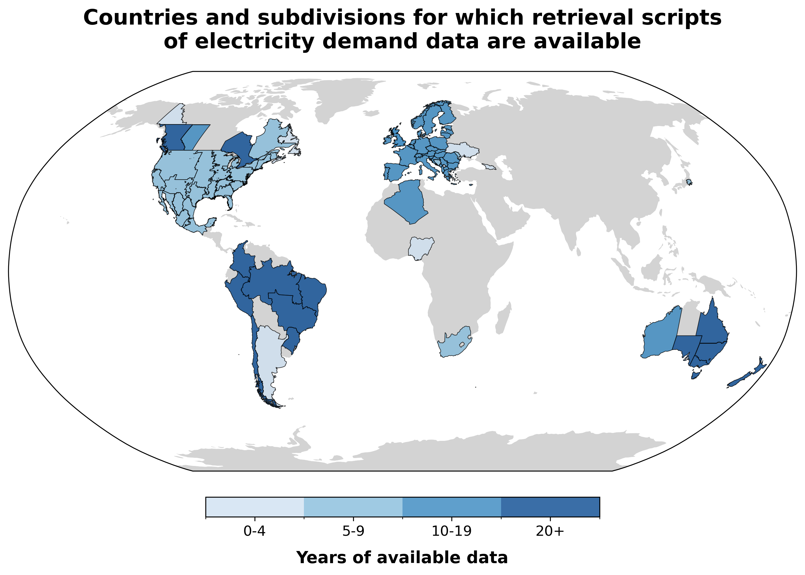

<h1 align="center">Electricity Demand Data</h1>

<h3 align="center">
    Global hourly electricity demand forecasting
</h3>

<p align="center">
    <a href="https://open-energy-transition.github.io/electric-demand-data/">
        <b>Documentation</b>
    </a>
</p>

<h3 align="center">
    <b>Supported by</b>
</h3>

<p align="center">
    <a href="https://www.breakthroughenergy.org/">
        
    </a>
</p>

## About

Electric Demand Data is a Python-based project focused on collecting, processing, and forecasting electricity demand data. The aim of this project is to support energy planning studies by using machine learning models to generate time series of future electricity demand or for countries without available data.

### Features

- Retrieval of open hourly and sub-hourly electricity demand data from public sources ([ETL](https://github.com/open-energy-transition/electric-demand-data/tree/main/ETL)).
- Retrieval of weather and socio-economic data ([ETL](https://github.com/open-energy-transition/electric-demand-data/tree/main/ETL)).
- Forecasting using machine learning models ([models](https://github.com/open-energy-transition/electric-demand-data/tree/main/models/)
- Modular design for adding new countries or data sources.
- Support for reproducible, containerized development.

The project is in active development, we are always looking for suggestions and contributions!

## Repository structure

electric-demand-data/
├── ETL/                 # Scripts for extracting, transforming, and loading data
├── models/              # Machine learning models for demand forecasting
│   └── xgboost/
├── docs/                # Project documentation (MkDocs)
├── .devcontainer/       # Development container configuration
├── Dockerfile           # Docker setup for containerized runs
└── pyproject.toml       # Project metadata and dependencies


## Data collection progress


Find the code that we used to retrieve the data in their respective files inside the [ETL](https://github.com/open-energy-transition/electric-demand-data/tree/main/ETL) folder.

## Development

This project uses [uv](https://github.com/astral-sh/uv) as a pacakge manager.
It can be used within the provided Dockerfile or installed standalone, see:
[Installing uv](https://docs.astral.sh/uv/getting-started/installation/)

Then clone the repository, and run:

```bash
git clone https://github.com/open-energy-transition/electric-demand-data.git
uv sync
```

### Useful commands

Jupyter [(details)](https://docs.astral.sh/uv/guides/integration/jupyter/#using-jupyter-within-a-project):

```bash
uv run --with jupyter jupyter lab --allow-root
```

Testing:

```bash
uv run pytest
```

Run this before commits:

```bash
uvx pre-commit
```

Only run ruff:

```bash
uvx ruff check
# automatically fix issues
uvx ruff check --fix
```

Check the code coverage:

```bash
uv run pytest --cov
```

## Documentation

The [documentation](https://open-energy-transition.github.io/electric-demand-data/) is currently hosted on GitHub pages connected to this repository.
It is built with [mkdocs](https://github.com/squidfunk/mkdocs-material).
To run it locally:

```bash
uv run mkdocs serve
```
