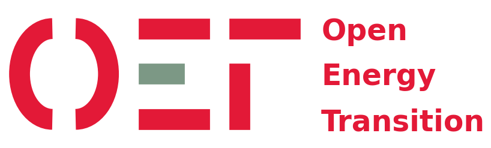
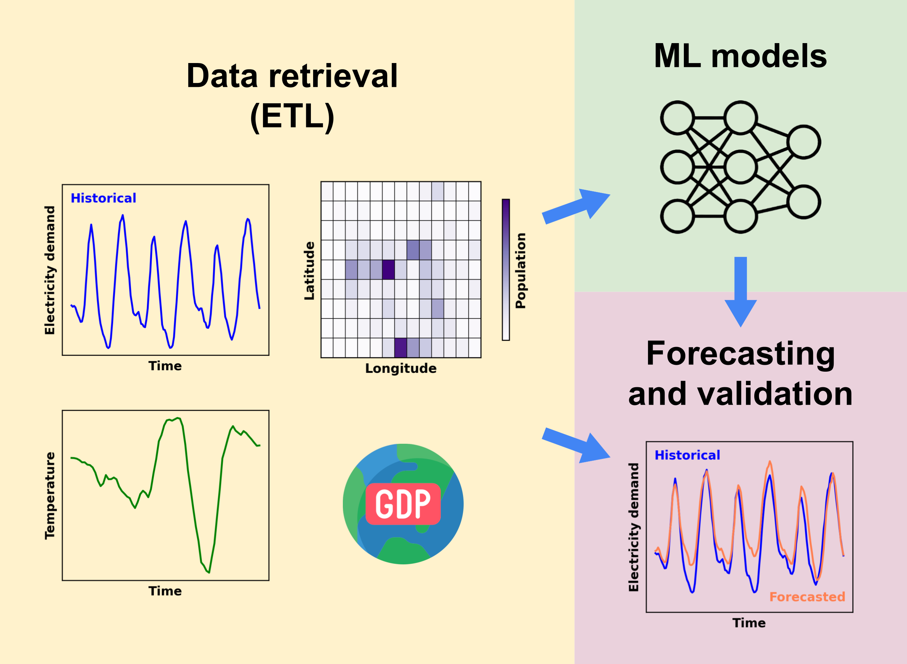
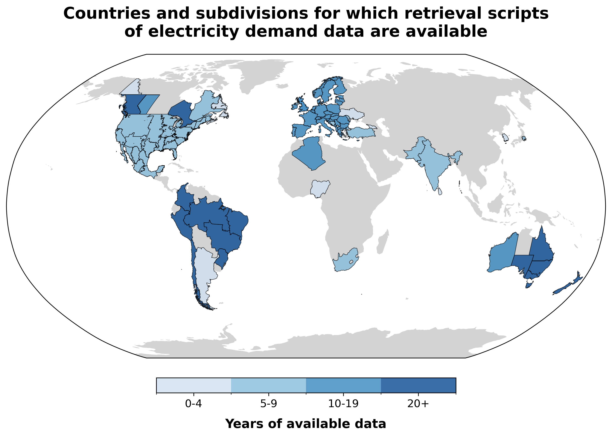

<h1 align="center">DemandCast</h1>

<h2 align="center">
    Global hourly electricity demand forecasting
</h2>

<p align="center">
    <a href="https://open-energy-transition.github.io/demandcast/">
        <b>Documentation</b>
    </a>
</p>

<h3 align="center">
    <b>A project developed by</b>
</h3>

<p align="center">
    <a href="https://www.openenergytransition.org/">
        
    </a>
</p>

<h3 align="center">
    <b>Supported by</b>
</h3>

<p align="center">
    <a href="https://www.breakthroughenergy.org/">
        
    </a>
</p>

## About

DemandCast is a Python-based project focused on collecting, processing, and forecasting hourly electricity demand data. The aim of this project is to support energy planning studies by using machine learning models to generate hourly time series of future electricity demand or for countries without available data.

### Features

- Retrieval of open hourly and sub-hourly electricity demand data from public sources ([ETL](https://github.com/open-energy-transition/demandcast/tree/main/ETL)).
- Retrieval of weather and socio-economic data ([ETL](https://github.com/open-energy-transition/demandcast/tree/main/ETL)).
- Forecasting using machine learning models ([models](https://github.com/open-energy-transition/demandcast/tree/main/models/)).
- Modular design for adding new countries or data sources.
- Support for reproducible, containerized development.

The project is in active development, we are always looking for suggestions and contributions!

## Repository structure

```
demandcast/
├── docs/                   # Project documentation (MkDocs)
├── ETL/                    # Scripts for extracting, transforming, and loading data
├── models/                 # Machine learning models for demand forecasting
├── .devcontainer/          # Development container configuration
├── .github/                # Github specifics such as actions
├── .gitignore              # File lists that git ignores
├── .pre-commit-config.yaml # Pre-commit configuration
├── .python-version         # Python version
├── CONTRIBUTING.md         # Guide to contributing
├── Dockerfile              # Docker setup for containerized runs
├── mkdocs.yml              # Documentation configuration file
├── pyproject.toml          # Project metadata and dependencies
├── ruff.toml               # Ruff configuration
└── uv.lock                 # Lockfile for project's dependencies
```

## DemandCast structure



## Historical electricity demand collection progress

<picture>
  <source media="(prefers-color-scheme: dark)" srcset="ETL/figures/available_entities_dark_mode.png">
  <source media="(prefers-color-scheme: light)" srcset="ETL/figures/available_entities_light_mode.png">
  
</picture>

Find the code that we used to retrieve the data in their respective files inside the [ETL](https://github.com/open-energy-transition/demandcast/tree/main/ETL) folder.

## Getting started

### 1. Clone the repository

```bash
git clone https://github.com/open-energy-transition/demandcast.git
cd demandcast
```

### 2. Set up your environment

This project uses [`uv`](https://github.com/astral-sh/uv) as a pacakge manager. It can be used within the provided Dockerfile or installed standalone (see [installing uv](https://docs.astral.sh/uv/getting-started/installation/))

```bash
uv sync
```

Alternatively, you may use `conda` to install the packages listed in `pyproject.toml`.

### 3. Run scripts

Scripts can be run directly using:

```bash
uv run path/to/script.py
```

If you have chosen `conda` as your package manager, you can run scripts with:

```bash
python path/to/script.py
```

Jupyter notebooks ([details](https://docs.astral.sh/uv/guides/integration/jupyter/#using-jupyter-within-a-project)) can be launched with:

```bash
uv run --with jupyter jupyter lab --allow-root
```

## Development workflow

### Run tests and check test coverage

```bash
uv run pytest
uv run pytest --cov --cov-report term-missing
```

### Pre-commit and lint code

```bash
uvx ruff format
uvx ruff check --fix
uvx mypy
uvx pre-commit
```

## Documentation

The [documentation](https://open-energy-transition.github.io/demandcast/) is currently hosted on GitHub pages connected to this repository. It is built with [mkdocs](https://github.com/squidfunk/mkdocs-material).

To run it locally:

```bash
uv run mkdocs serve
```

## Mantainers

The project is maintained by the [Open Energy Transition](https://www.openenergytransition.org/) team. The team members currently involved in this project are:

- [Kevin Steijn](https://github.com/ElectricMountains)
- [Vamsi Priya Goli](https://github.com/Vamsipriya22)
- [Enrico Antonini](https://github.com/eantonini)

## Contributing

We welcome contributions in the form of:

- Country-specific ETL modules
- New or improved forecasting models
- Documentation and testing enhancements

Please follow the repository’s structure and submit your changes via pull request.

## License

This project is licensed under the GNU Affero General Public License v3.0 (AGPL-3.0).
